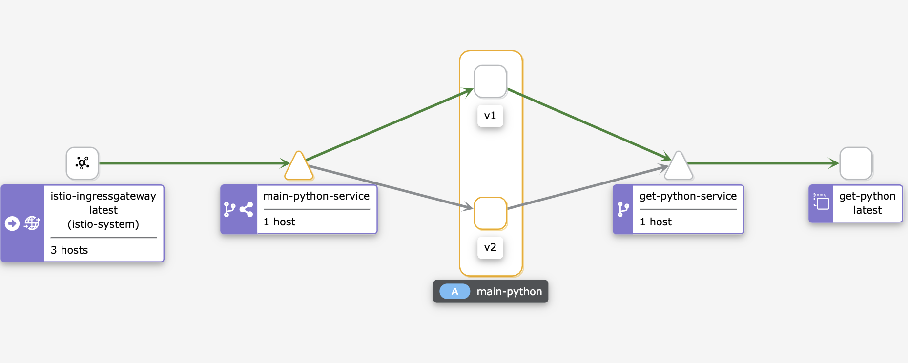
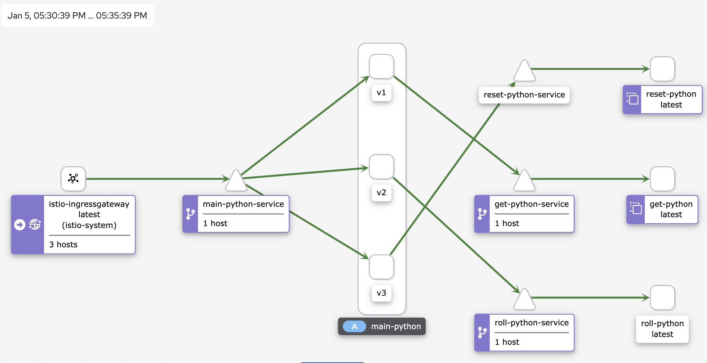

# Download git and use it to clone this repo

1. Download k8s cluster manager e.g. Docker
2. Docker on a laptop is best to start with to get you commands to create images and manage them
3. Download kubectl, kops, kubeadm to manage k8s cluster and apps (kops - if youre using AWS, GCE or external cloud infra, else kubectl will do)
4. Some of the commands are built for zsh (but w/ a few tweaks can work w/ bash also)
5. Download golang

#####################################################################################################

# Functionally test app
make clean
make
bin/main-go

curl http://localhost:8001 ({/counter} {/counter/get})

# Build the docker image for main-python
docker build --rm -f docker/Main_Dockerfile -t main-go:latest .

# Clean up unused images
docker image prune

# Clean up unused containers, images etc
docker system prune  

# List the image
docker image ls

# Test image to get a shell
docker run -it main-go /bin/sh   

# Test image w/ app
docker run -p 8000:8001 main-go

# Remove image
docker image rm -f main-go 

#####################################################################################################

# Create vol
kubectl apply -f k8s/pv-vol.yaml  

# Create claim
kubectl apply -f k8s/pv-claim.yaml

# Deploy main-py
kubectl apply -f k8s/main-go.yaml

# Launch pod to test pv
kubectl apply -f k8s/pv-test.yaml 

# Launch pod for get counter
kubectl apply -f k8s/get-py.yaml

# Launch pod for roll counter
kubectl apply -f k8s/roll-py.yaml

# Launch pod for reset counter
kubectl apply -f k8s/reset-py.yaml

# Start service for main
kubectl apply -f k8s/service.yaml

# Start service for get counter
kubectl apply -f k8s/get-service.yaml

# Start service for roll counters
kubectl apply -f k8s/roll-service.yaml

# Start service for reset counter
kubectl apply -f k8s/reset-service.yaml

# To debug
kubectl exec -it  <PODNAME> /bin/sh
#####################################################################################################
# Test app  this will get the counters
http://localhost:5000

# Get Counters
curl http://localhost:6000/counter/get/get -> Internal microservice
curl http://localhost:5000
curl http://localhost:5000/counter/main
curl http://localhost:5000/counter/get

# Roll Counters
curl -X PUT http://localhost:8000/counter/roll/roll -> Internal microservice
curl -X PUT http://localhost:5000/counter/roll

# Reset Counters
curl -X PUT http://localhost:7000/counter/reset/reset -> Internal microservice
curl -X PUT http://localhost:5000/counter/reset 

# use pv-test to launch/exec shell and check counters

kubectl exec -it nfs-dataaccess /bin/sh

# Test by bouncing/deleting pods using kubectl or mgmnt console 

kubectl delete pod -l app=main-python
kubectl delete pod -l app=get-python
kubectl delete pod-l app=roll-python
kubectl delete pod -l app=reset-python

# New pods will reconnect and continue counting from before

# Tailing logs
kubectl logs -f -n default -l app=main-python
kubectl logs -f -n default -l app=get-python
kubectl logs -f -n default -l app=roll-python
kubectl logs -f -n default -l app=reset-python

#####################################################################################################
# Creates mgmtn console
kubectl apply -f https://raw.githubusercontent.com/kubernetes/dashboard/v2.4.0/aio/deploy/recommended.yaml

# Creates account/access
kubectl create clusterrolebinding serviceaccounts-cluster-admin --clusterrole=cluster-admin --group=system:serviceaccounts 

# Browser/UI 
http://localhost:8001/api/v1/namespaces/kubernetes-dashboard/services/https:kubernetes-dashboard:/proxy/.

# This will start the mmgnt console
kubectl proxy

# Get TOKEN to log into above
APISERVER=$(kubectl config view --minify | grep server | cut -f 2- -d ":" | tr -d " ")
SECRET_NAME=$(kubectl get secrets | grep ^default | cut -f1 -d ' ')
TOKEN=$(kubectl describe secret $SECRET_NAME | grep -E '^token' | cut -f2 -d':' | tr -d " ")
echo $TOKEN

#####################################################################################################
# W/ NFS
#####################################################################################################

# Setup NFS Server (ubuntu)
ssh testuser@10.0.0.228/testuser (this has sudo)
/etc/exports
>>>/srv/data     *(rw,fsid=0,async,no_subtree_check,no_auth_nlm,insecure,no_root_squash)
exportfs -ra

# Setup NFS server (raspberry pi)

ssh pi@10.0.0.52/<usual> (this has sudo)
/etc/exports
>>>/srv/data     *(rw,fsid=0,async,no_subtree_check,no_auth_nlm,insecure,no_root_squash)
exportfs -ra

# Raspberry pi - get buster
/etc/apt/sources.list
deb http://raspbian.raspberrypi.org/raspbian/ buster main contrib non-free rpi
deb http://archive.raspberrypi.org/debian/ buster main

# Install/setup NFS server on raspberry pi
apt update
apt full-upgrade
apt-get install nfs-kernel-server
systemctl start nfs-kernel-server.service

# Test nfs mount from MAC
 mount  -t nfs -o resvport,nfsvers=4 10.0.0.228:/srv/data mnt/data

# Setup K8s w/ NFS mounts
kubectl apply -f k8s/nfs-pv-vol.yaml 
kubectl apply -f k8s/nfs-pv-claim.yaml 
kubectl apply -f k8s/nfs-pv-test.yaml

# Test NFS (make sure k8s test pod is able to see the mount point)
kubectl exec -it nfs-dataaccess /bin/sh

# Test app like above
curl http://localhost:5000
cat /mnt/data/counter.txt

#####################################################################################################
# W/ Service Mesh istio
#####################################################################################################

kubectl apply -f sample/addons (this will install all)

kubectl label namespace default istio-injection=enabled

export INGRESS_HOST=$(kubectl -n istio-system get service istio-ingressgateway -o jsonpath='{.status.loadBalancer.ingress[0].hostname}')
export INGRESS_PORT=$(kubectl -n istio-system get service istio-ingressgateway -o jsonpath='{.spec.ports[?(@.name=="http2")].port}')
export SECURE_INGRESS_PORT=$(kubectl -n istio-system get service istio-ingressgateway -o jsonpath='{.spec.ports[?(@.name=="https")].port}')
export GATEWAY_URL=$INGRESS_HOST:$INGRESS_PORT

# Testing w/ Service mesh

curl localhost/counter/get
curl -X PUT localhost/counter/roll
curl localhost/counter/get

# Launch Kiali dashboard
istioctl dashboard kiali
kubectl -n istio-system port-forward service/kiali 20001:20001

# Launch grafana
istioctl dashboard grafana
kubectl -n istio-system port-forward service/grafana 3000:3000

# Launch prometheus
istioctl dashboard prometheus
kubectl -n istio-system port-forward service/prometheus 9090:9090

# Testing Canary w/ Service mesh - roll. Tail / follow the roll-logs to spot incr 10 vs 2
for i in $(seq 1 100); do curl -s -X PUT "http://localhost/counter/roll"; echo "\n"; done
kubectl logs -f -n default -l app=roll-python

# Testing Canary w/ Service mesh - get. Tail / follow the main's get-logs to spot v2 api/logs
for i in $(seq 1 100); do curl -s "http://localhost/counter/get"; echo "\n"; done
kubectl logs -f -n default -l app=main-python

# Deploy main-gw separately (this contains the destination rule also)
kubectl apply -f k8s/main-gw.yaml 

# Two routing modes based headers (header) and percentage of traffic (canary) - both can co-exist
kubectl apply -f k8s/canary-routing.yaml 

# Test routes
 for i in $(seq 1 100); do curl -s "http://localhost/counter/get"; echo "\n" ;  done

# W/ parellelism of 10
 seq 1 100 | xargs -n1 -P10 curl -s "http://localhost/counter/get"; echo "\n"; done
 
kubectl apply -f k8s/header-routing.yaml

curl -H x1-version:v1 localhost/counter/get

curl -H x1-version:v2 localhost/counter/get 

# Three versions - API based routing - get in one version (v1), roll in another (v2) and reset in yet another (v3).
for i in $(seq 1 100); do curl -s -H x1-version:v2 -X PUT "http://localhost/counter/roll"; curl -s "http://localhost/counter/get"; curl -s -X PUT "http://localhost/counter/reset"; echo "\n" ;  done

